# MongoDB小试牛刀

[MongoDB小试牛刀](#mongodb小试牛刀)

- [一、简介](#一简介)
- [二、Mac安装\&启动\&链接](#二mac安装启动链接)
- [三、基本常用命令](#三基本常用命令)
- [四、CRUD操作](#四crud操作)
  - [（一）增：插入文档](#一增插入文档)
  - [（二）删：删除文档](#二删删除文档)
  - [（三）改：修改文档](#三改修改文档)
  - [（四）查：查询文档](#四查查询文档)
    - [常见的查询运算符](#常见的查询运算符)
- [参考资料](#参考资料)


## 一、简介

1. **简单介绍**

- MongoDB是一个基于`分布式文件存储`的数据库
- MongoDB是一个介于`关系型数据库`和`非关系型数据库`之间的产品。是非关系型数据库中功能最丰富，最像关系型数据库的。
- MongoDB中的记录是一个文档，它是一个由`字段和值对`（field:value）组成的数据结构。MongoDB文档类似于JSON对象，即一个文档认为就是一个对象。字段的数据类型是字符型，它的值除了使用基本的一些类型外，还可以包括其他文档、普通数组和文档数组。

2. **应用场景**

- `High performance：`对数据库高并发读写的需求
- `Huge Storage：`对海量数据的高效率存储和访问的需求
- `High Scalability && High Availability：`对数据库的高扩展性和高可用性的需求

3. **MongoDB VS MySQL**

- 特点

  |      |                           MongoDB                            |                           MySQL                            |
  | :--: | :----------------------------------------------------------: | :--------------------------------------------------------: |
  | 数据 | 以文档形式存储，每个文档类似于JSON对象，由字段和值组成。使得MongoDB可以存储复杂的数据结构 |        数据存储子在表中，具有严格的表结构和数据类型        |
  | 模式 |   无模式；即不需要预先定义数据结构，可以动态添加或更改字段   | 需要预定义模式，表结构在创建时必须确定，修改表结构相对复杂 |
  | 扩展 |     支持分片，可以将数据分布在多个服务器上，方便水平扩展     | 垂直扩展较容易，水平扩展需要使用外部工具，比如分区、集群等 |

- 体系结构

  | SQL术语/概念 | MongoDB术语/概念 | 解释/说明                            |
  | ------------ | ---------------- | ------------------------------------ |
  | database     | database         | 数据库                               |
  | table        | collection       | 数据库表/集合                        |
  | row          | document         | 数据记录行/文档                      |
  | column       | field            | 数据字段/域                          |
  | index        | index            | 索引                                 |
  | Table joins  |                  | 表连接，MongoDB不支持                |
  |              | 嵌入文档         | MongoDB通过嵌入式文档来替代多表连接  |
  | primary key  | primary key      | 主键，MongoDB自动将_id字段设置为主键 |

## 二、Mac安装&启动&链接

- 参考[Mac安装MongoDb保姆级教程以及踩坑笔记（图文详解）](https://blog.csdn.net/weixin_46019681/article/details/125491883)


## 三、基本常用命令

1. 数据库相关

   ```sql
   #查看所有数据库
   show databases
   
   #选择数据库（如果数据库不存在，不会报错；会隐式创建；当后期该数据库有数据时会自动创建）
   use 数据库名
   
   #删除数据库（先选择数据库）
   db.dropDatabase()
   ```

   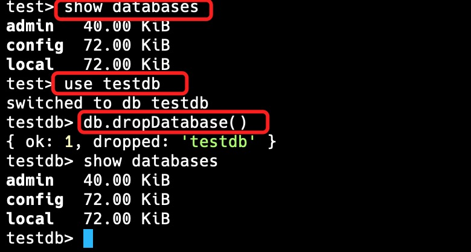

2. 集合相关

   ```sql
   #查看所有集合
   show collections
   
   #创建集合（插入数据会隐式创建）
   db.createCollection('集合名')
   
   #删除集合
   db.集合名.drop()
   ```

   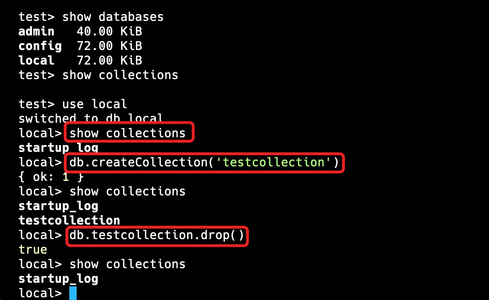

## 四、CRUD操作

### （一）增：插入文档

```sql
db.集合名.insert(json数据)
```

- 集合存在则直接插入数据，不存在则隐式创建集合并插入数据

- MongoDB会自动给每条数据创建全球唯一的`_id`键（我们也可以自定义`_id`的值，只要给插入的json数据增加`_id`键即可覆盖，但是不推荐这样做）

  - 插入一条

  ```sql
  #选择数据库
  use school
  
  #创建集合
  db.createCollection('student')
  
  #插入数据
  db.student.insert({name:"David",age:"23"})
  
  #查看数据
  db.student.fine()
  ```

  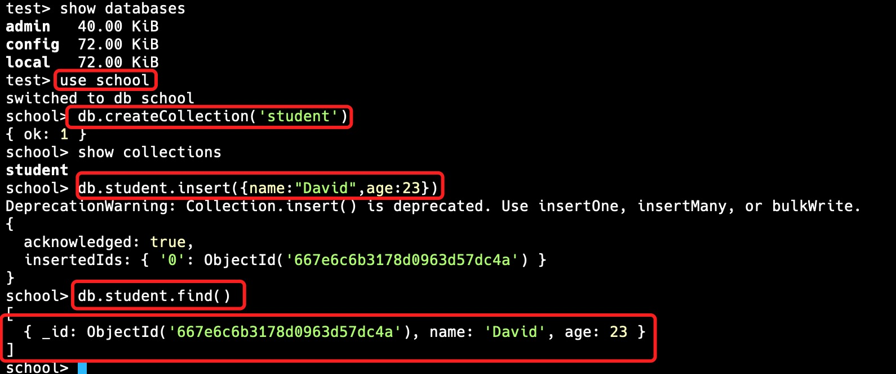

  - 一次插入多条

  ```sql
  #插入数据
  db.student.insert([{name:"Alice",age:21},{name:"Bob",age:22},{name:"Eve",age:24}])
  ```

  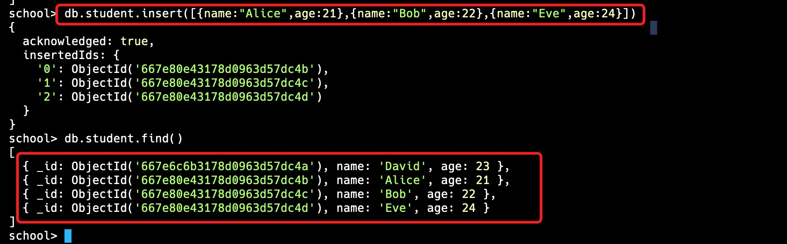

  - 利用for循环插入数据

  ```sql
  for(var i=1;i<0;i++){
  	db.student.insert({name:"a"+i,age:i})
  }
  ```

  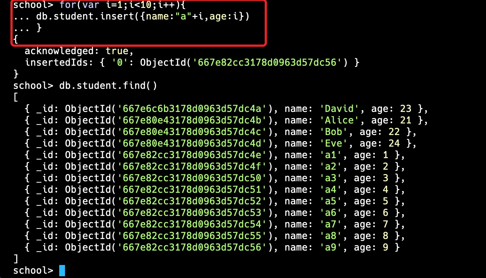

### （二）删：删除文档

1. MongoDB Shell提供以下方法从集合中删除文档：

   - 要删除多个文档，请使用`db.collection.deleteMany(filter,options)`。

   - 要删除单个文档，请使用`db.collection.deleteOne(filter,options)`。

     - `filter`：一个查询条件，用来匹配要删除的文档
     - `options`：可选参数，包含一些额外的选项

   - 假设我们有一个名为`students`的集合，其中包含以下文档：

     ```json
     [
       { "_id": 1, "name": "Alice", "age": 22 },
       { "_id": 2, "name": "Bob", "age": 22 },
       { "_id": 3, "name": "Eve", "age": 24 },
       { "_id": 4, "name": "Cat", "age": 22 },
       { "_id": 5, "name": "David", "age": 21 }
     ]
     ```

- 删除所有文档

  要删除集合中的所有文档，请将空的过滤器文档{}传递到`db.collection.deleteMany()`方法

  ```sql
  #删除student集合中的所有文档
  use school
  db.student.deleteMany({})
  ```

  

- 删除符合条件的所有文档

  可以指定条件或过滤器来标识要删除的文档。要指定相等条件，请在查询筛选器文档中使用`<field>:<value>`表达式：要删除所有符合删除条件的文档，请将过滤器参数传递给`deleteMany()`方法。

  ```sql
  #要删除student结合中所有age等于22的文档：
  db.student.deleteMany({age:22})
  ```

  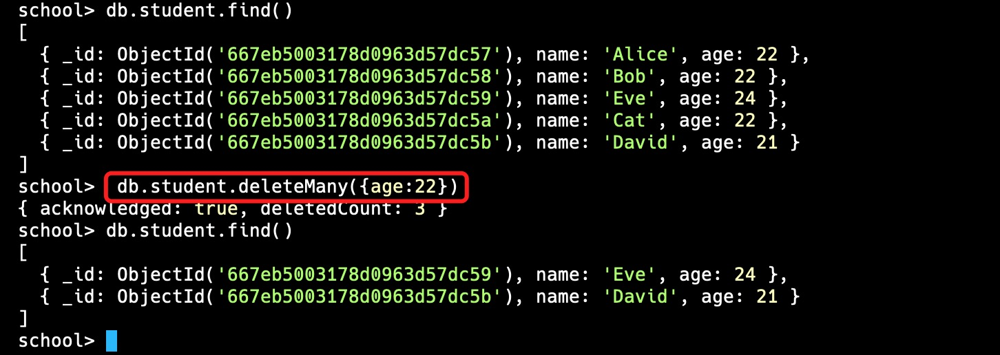

- 仅删除一个符合条件的文档

​	`deleteOne()`方法用于删除集合中**第一个**符合条件的文档。	

```sql
db.students.deleteOne({age:22})
```

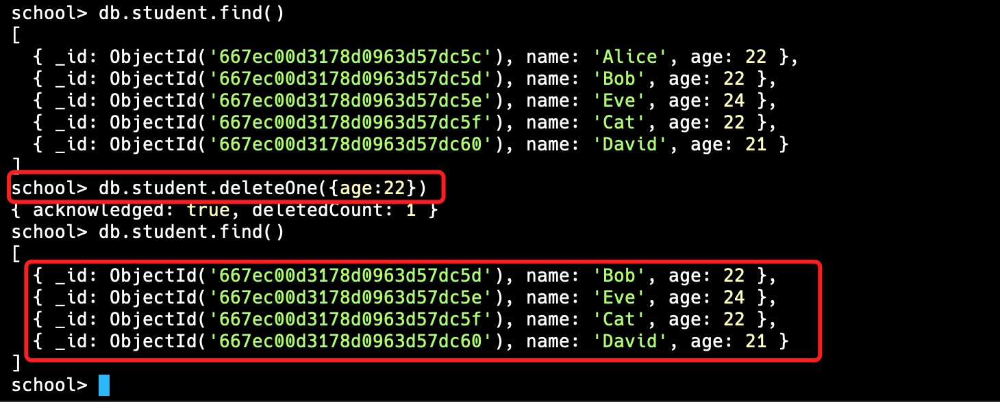

由结果可知，只删除了第一个`age`为22的文档（Alice）

- 返回被删除文档

  `deleteMany()`、`deleteOne()`等命令在删除文档后只会返回确认性的信息，如果希望获得被删除的文档，则可以使用`findOneAndDelete()`

  ```sql
  #返回被删除的文档信息
  db.student.findOneAndDelete({age:22})
  ```

  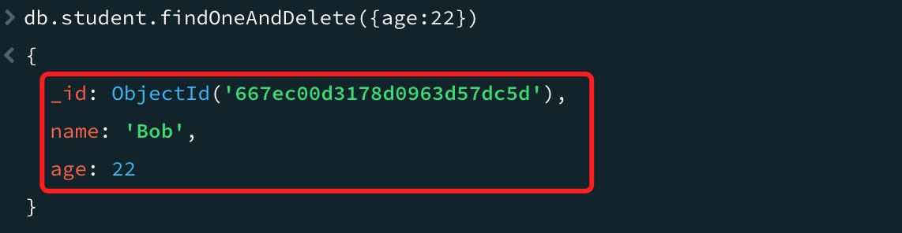

​	

### （三）改：修改文档

​	在MongoDB中，更新文档的操作可以使用多种方法实现，常见的方法包括`updateOne()`、`updateMany()`、`replaceOne()`等。

1. `updateOne()`

   `updateOne()`方法用于更新匹配过滤器的单个文档。

   - 语法

     ```
     db.collection.updateOne(filter,update,options)
     ```

     - filter：用于查找文档的查询条件
     - update：指定更新操作的文档或更新操作符
     - options：可选参数对象，如upsert、arrayFilters等

     | 更新操作符 |   作用   |
     | :--------: | :------: |
     |    $inc    |   递增   |
     |  $rename   | 重命名列 |
     |    $set    | 修改列值 |
     |   $unset   |  删除列  |

     ```sql
     db.student.updateone(
     	{name:'Eve'},#过滤条件
       {$set:{age:22}},#更新操作
       {upsert:false}#可选参数
     )
     #upsert 参数的解释：
     #upsert: false：表示如果没有找到符合条件的文档，就不会插入新的文档（默认行为）。
     #upsert: true：表示如果没有找到符合条件的文档，就会根据查询条件和更新内容插入一个新文档。
     ```

     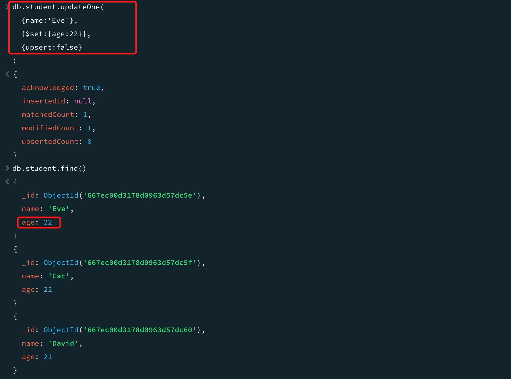

2. `updateMany()`

​	`updateMany()`方法用于更新所有匹配过滤器的文档。语法同`updateOne()`	

```sql
db.student.updateMany(
	{age:{$lt:23}},#过滤条件
  {$rename:{age:"grade"}},#更新操作
  {upsert:false}#可选参数
)
```

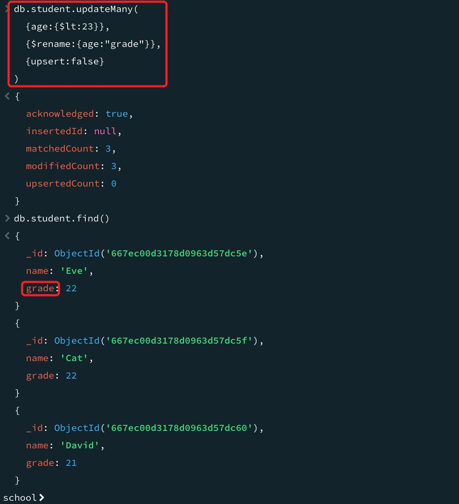

3. `replaceOne()`

​	`replaceOne()`方法用于替换匹配过滤器的单个文档，新的文档将完全替换旧的文档。语法同`updateOne()`

```sql
db.student.replaceOne(
	{name:'Eve'},#过滤条件
  {name:"Eve",grade:22,status:active}
)
```

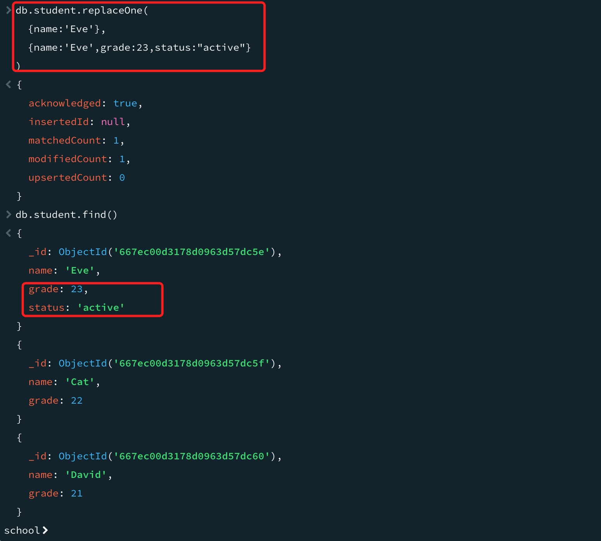


### （四）查：查询文档

MongoDB查询文档使用`find()`方法。`find()`方法以非结构化的方式来显示所有文档。

- 语法

  ```sql
  db.collection.find(query, projection)
  ```

  - query：用于查找文档的查询条件。默认为{}，即匹配所有文档
  - projection（可选）：指定返回结果中包含或排除的字段

- 实例

  ```sql
  db.student.find(
  	{age:{$lt:23}},#查询条件
    {name:1,grade:1,_id:0}#投影
  )
  
  #投影 { name: 1, age: 1, _id: 0 }：
  #只返回name和age字段，值为1表示返回。
  #"_id": 0表示不返回_id字段。
  ```

  #### 常见的查询运算符

  | 运算符 |         含义         |
  | :----: | :------------------: |
  | `$gt`  | 大于（greater than） |
  | `$lt`  |  小于（less than）   |
  | `$gte` |       大于等于       |
  | `$lte` |       小于等于       |
  | `$eq`  |         等于         |
  | `$ne`  |        不等于        |
  | `$in`  |       在数组中       |
  | `$nin` |      不在数组中      |

  这些运算符可以用于构建各种查询条件。例如：

  - `{ age: { $gt: 23 } }`：查找所有`age`大于23的文档。
  - `{ age: { $lte: 30 } }`：查找所有`age`小于或等于30的文档。
  - `{ name: { $eq: "Alice" } }`：查找所有`name`等于"Alice"的文档。

.jpg)


## 参考资料

- [MongoDB从零开始详细教程(超详细讲解)](https://blog.csdn.net/qq_45173404/article/details/114260970)
- [Mac安装MongoDb保姆级教程以及踩坑笔记（图文详解）](https://blog.csdn.net/weixin_46019681/article/details/125491883)
- [MongoDB数据库手册](https://www.mongodb.com/zh-cn/docs/manual/)
- [MongoDB教程](https://www.runoob.com/mongodb/mongodb-tutorial.html)